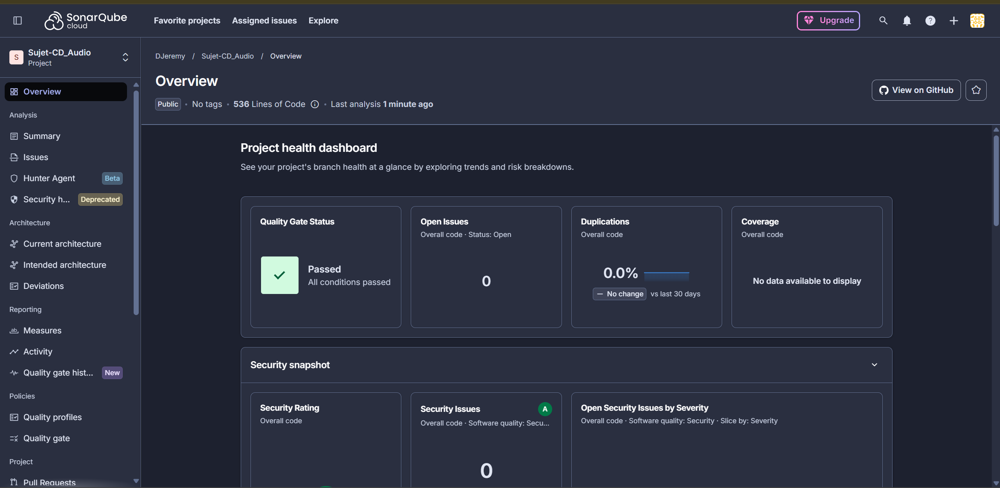

Insérez ici vos commentaires, retours ou propositions.# Retours et propositions d'amélioration

## 📋 Résumé du travail effectué

### Mise en place de l'environnement
- Fork et clone du projet, configuration des variables d'environnement
- Correction d'un problème de compatibilité PostgreSQL 18+ (structure de volume Docker modifiée)
- Lancement de l'application en mode développement (DB via Docker, backend/frontend en local)
  et en mode production (tout conteneurisé)

## ✅ Tests obligatoires

### Tests unitaires
- 5 tests sur `cdController.js` (getAllCDs, addCD, deleteCD), avec mock de la connexion
  PostgreSQL via `jest.mock`
- Fichier : `server/Controllers/__tests__/cdController.test.js`

### Tests d'intégration
Deux interactions distinctes ont été testées, comme demandé :
 
- **API ↔ base de données** : 3 tests couvrant le cycle complet POST/GET/DELETE sur une
  vraie base PostgreSQL (via Docker), avec `supertest`
  Fichier : `server/tests/integration/cdRoutes.integration.test.js`
- **API ↔ frontend** : 3 tests appelant réellement `cdService.js` (aucun mock) contre le
  backend Express et la base PostgreSQL réels, pour valider la communication HTTP complète
  entre le frontend et l'API
  Fichier : `client/src/services/__tests__/cdService.integration.test.js`
### Tests End-to-End (Cypress)
- Scénario complet : ajout d'un CD → affichage dans la liste → suppression
- Fichier : `client/cypress/e2e/cd_management.cy.js`
- **Bonus** : tests multi-viewport (mobile, tablette, desktop) pour valider le responsive
  Fichier : `client/cypress/e2e/responsive.cy.js`

### Tests End-to-End (Cypress)
- Scénario complet : ajout d'un CD → affichage dans la liste → suppression
- Fichier : `client/cypress/e2e/cd_management.cy.js`
- **Bonus** : tests multi-viewport (mobile, tablette, desktop) pour valider le responsive
  Fichier : `client/cypress/e2e/responsive.cy.js`

## 🎁 Points bonus réalisés

### Testcontainers
- 3 tests d'intégration (POST/GET/DELETE) exécutés sur un conteneur PostgreSQL isolé,
  démarré et détruit automatiquement pour chaque run (aucune dépendance à une base
  partagée, environnement toujours propre)
- Fichier : `server/tests/integration/cdRoutes.testcontainers.test.js`

### Tests de composants React
- 8 tests avec Vitest + React Testing Library couvrant l'affichage, les interactions
  utilisateur et les appels aux services mockés :
  - `CDItem.test.jsx` (2 tests) : affichage des infos, suppression
  - `AddCD.test.jsx` (3 tests) : affichage du formulaire, soumission valide, blocage si
    champ vide
  - `CDList.test.jsx` (3 tests) : liste vide, liste remplie, suppression avec rafraîchissement
- Fichiers : `client/src/components/__tests__/`

### Analyse SonarCloud
Analyse initiale : 9 vulnérabilités de sécurité + plusieurs code smells.

Corrections apportées :
- **cdService.js** : validation de l'`id` avant construction de l'URL (protection contre
  la manipulation d'URL avec des données non validées)
- **server.js** :
  - Restriction de la politique CORS à l'origine du frontend uniquement (au lieu d'accepter
    toutes les origines)
  - Désactivation du header `X-Powered-By` (masque la technologie/version du framework)
- **Dockerfiles (client et server)** :
  - Remplacement de `COPY . .` par des `COPY` explicites (fichier par fichier / dossier par
    dossier) pour éliminer le risque de copier des données sensibles dans l'image
  - Ajout de fichiers `.dockerignore` (exclusion de `.env`, `.git`, `node_modules`, tests, etc.)
  - Exécution des conteneurs avec un utilisateur non-root (`node` pour le backend, image
    `nginx-unprivileged` pour le frontend)
- **package-lock.json** : fichiers de verrouillage des dépendances correctement versionnés
  (garantit des builds reproductibles)
- **Qualité de code** : correction du naming d'un `useState` non conforme (`setCDs` → `setCds`),
  utilisation de `toHaveLength()` au lieu d'assertions génériques sur `.length`
- **Accessibilité** : correction du contraste insuffisant du bouton principal (bleu `#007bff`
  → `#0056b3`, conforme WCAG AA)
- **Faux positifs** : exclusion des rapports générés `zap_report*.html` de l'analyse
  (artefacts de CI, pas du code source de l'application)

Résultat final : 0 vulnérabilité de sécurité, code conforme aux standards de qualité SonarCloud.

### Scan OWASP ZAP (baseline)
Scan initial : 0 FAIL, 58 PASS, 9 WARN (headers de sécurité HTTP manquants).

Corrections apportées via une configuration nginx personnalisée (`client/nginx.conf`) :
- Ajout de `X-Content-Type-Options: nosniff`
- Ajout de `X-Frame-Options: DENY` (protection anti-clickjacking)
- Ajout d'une `Content-Security-Policy` complète (default-src, script-src, style-src,
  frame-ancestors, object-src, base-uri, form-action)
- Ajout de `Permissions-Policy` (désactivation géolocalisation, micro, caméra)
- Ajout de `Cross-Origin-Embedder-Policy`, `Cross-Origin-Opener-Policy`,
  `Cross-Origin-Resource-Policy`
- Désactivation de `server_tokens` (masque la version nginx)
- `Cache-Control: no-store` (empêche la mise en cache de contenu potentiellement sensible)

Résultat final : 0 FAIL, 64 PASS, 3 WARN mineurs et justifiés :
- `style-src 'unsafe-inline'` dans la CSP : nécessaire pour la compatibilité avec les styles
  injectés au runtime par React/Vite ; un durcissement via CSP nonces serait possible mais
  jugé disproportionné pour la taille du projet
- "Non-Storable Content" : conséquence volontaire du `Cache-Control: no-store` (compromis
  sécurité > performance de cache)
- "Modern Web Application" : avertissement purement informatif de ZAP, ne constitue pas
  une vulnérabilité

## 💡 Pistes d'amélioration non implémentées (par manque de temps)
- DockerScout pour l'analyse des vulnérabilités des images Docker
- Durcissement supplémentaire de la CSP via un système de nonces pour éliminer
  `unsafe-inline`
- Ajout d'une authentification / autorisation sur l'API (actuellement totalement ouverte,
  ce qui est acceptable pour un exercice mais pas pour de la production)